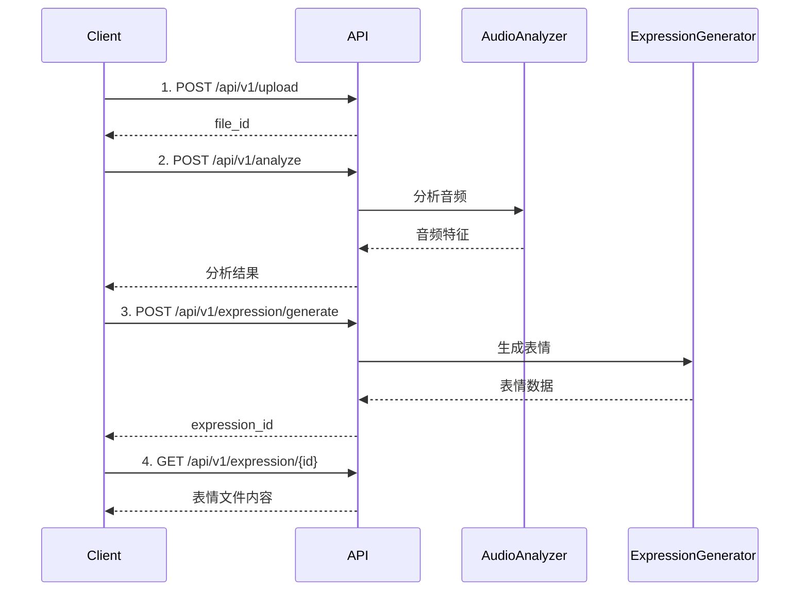

# API 接口文档 v1.0

歌颜随动后端API完整接口说明。

## 🌐 基础信息

- **Base URL**: `http://localhost:8000`
- **API Version**: v1
- **Content-Type**: `application/json`
- **Timeout**: 300秒（音频处理接口）

---

## 📋 接口列表

### 1. 健康检查

检查服务运行状态。

**请求**

```http
GET /health
```

**响应**

```json
{
  "status": "healthy",
  "service": "geyan-suidong-api"
}
```

**状态码**
- `200`: 服务正常
- `500`: 服务异常

---

### 2. 文件上传

上传音频文件到服务器。

**请求**

```http
POST /api/v1/upload
Content-Type: multipart/form-data
```

**参数**

| 参数名 | 类型 | 必填 | 说明 |
|-------|------|------|------|
| file | File | 是 | 音频文件（支持 mp3, wav, m4a, flac, ogg） |

**cURL示例**

```bash
curl -X POST http://localhost:8000/api/v1/upload \
  -F "file=@/path/to/audio.mp3"
```

**响应**

```json
{
  "success": true,
  "message": "文件上传成功",
  "data": {
    "file_id": "uuid-string",
    "filename": "audio.mp3",
    "file_path": "data/uploads/uuid-string.mp3",
    "file_size": 3145728
  }
}
```

**状态码**
- `200`: 上传成功
- `400`: 文件格式不支持
- `413`: 文件过大
- `500`: 服务器错误

---

### 3. 音频分析

分析音频特征（节拍、音调、情感等）。

**请求**

```http
POST /api/v1/analyze
Content-Type: application/json
```

**请求体**

```json
{
  "file_id": "uuid-string",
  "sample_rate": 44100,
  "hop_length": 512
}
```

**参数说明**

| 参数名 | 类型 | 必填 | 默认值 | 说明 |
|-------|------|------|--------|------|
| file_id | string | 是 | - | 上传文件返回的ID |
| sample_rate | integer | 否 | 44100 | 采样率 |
| hop_length | integer | 否 | 512 | 跳帧长度 |

**cURL示例**

```bash
curl -X POST http://localhost:8000/api/v1/analyze \
  -H "Content-Type: application/json" \
  -d '{
    "file_id": "uuid-string",
    "sample_rate": 44100,
    "hop_length": 512
  }'
```

**响应**

```json
{
  "success": true,
  "message": "音频分析完成",
  "data": {
    "file_id": "uuid-string",
    "duration": 180.5,
    "tempo": 120.0,
    "beat_count": 360,
    "beats": [0.5, 1.0, 1.5, 2.0, ...],
    "emotion_scores": {
      "happy": 0.65,
      "sad": 0.15,
      "energetic": 0.75,
      "calm": 0.20,
      "angry": 0.05
    },
    "energy_stats": {
      "mean": 0.68,
      "max": 0.95,
      "min": 0.12,
      "std": 0.18
    },
    "pitch_stats": {
      "mean": 440.0,
      "max": 880.0,
      "min": 220.0
    },
    "spectral_stats": {
      "mean": 2500.0,
      "max": 8000.0,
      "min": 500.0
    }
  }
}
```

**状态码**
- `200`: 分析成功
- `404`: 文件不存在
- `500`: 分析失败

---

### 4. 表情生成

基于音频分析结果生成Live2D表情数据。

**请求**

```http
POST /api/v1/expression/generate
Content-Type: application/json
```

**请求体**

```json
{
  "file_id": "uuid-string",
  "time_resolution": 0.1,
  "enable_smoothing": true,
  "sensitivity": 1.0
}
```

**参数说明**

| 参数名 | 类型 | 必填 | 默认值 | 说明 |
|-------|------|------|--------|------|
| file_id | string | 是 | - | 上传文件返回的ID |
| time_resolution | float | 否 | 0.1 | 时间分辨率（秒），范围: 0.01-1.0 |
| enable_smoothing | boolean | 否 | true | 是否启用平滑处理 |
| sensitivity | float | 否 | 1.0 | 表情敏感度，范围: 0.1-3.0 |

**cURL示例**

```bash
curl -X POST http://localhost:8000/api/v1/expression/generate \
  -H "Content-Type: application/json" \
  -d '{
    "file_id": "uuid-string",
    "time_resolution": 0.1,
    "enable_smoothing": true,
    "sensitivity": 1.0
  }'
```

**响应**

```json
{
  "success": true,
  "message": "表情生成完成",
  "data": {
    "expression_id": "uuid-string",
    "file_id": "uuid-string",
    "keyframe_count": 1805,
    "duration": 180.5,
    "expression_file_path": "data/expressions/uuid-string.json",
    "metadata": {
      "model_name": "default",
      "time_resolution": 0.1,
      "smoothing_enabled": true,
      "sensitivity": 1.0
    }
  }
}
```

**状态码**
- `200`: 生成成功
- `404`: 文件不存在
- `500`: 生成失败

---

### 5. 获取表情数据

获取已生成的表情文件内容。

**请求**

```http
GET /api/v1/expression/{expression_id}
```

**参数**

| 参数名 | 类型 | 必填 | 说明 |
|-------|------|------|------|
| expression_id | string | 是 | 表情文件ID |

**cURL示例**

```bash
curl -X GET http://localhost:8000/api/v1/expression/uuid-string
```

**响应**

```json
{
  "success": true,
  "data": {
    "metadata": {
      "version": "1.0",
      "model_name": "default",
      "duration": 180.5,
      "keyframe_count": 1805,
      "created_at": "2024-12-10T03:45:00Z"
    },
    "audio_features": {
      "tempo": 120.0,
      "emotion_scores": {
        "happy": 0.65,
        "energetic": 0.75
      }
    },
    "keyframes": [
      {
        "timestamp": 0.0,
        "parameters": {
          "ParamEyeLOpen": 1.0,
          "ParamEyeROpen": 1.0,
          "ParamMouthOpenY": 0.2,
          "ParamEyeBrowLY": 0.0,
          "ParamEyeBrowRY": 0.0
        }
      },
      {
        "timestamp": 0.1,
        "parameters": {
          "ParamEyeLOpen": 0.8,
          "ParamEyeROpen": 0.8,
          "ParamMouthOpenY": 0.5
        }
      }
    ]
  }
}
```

**状态码**
- `200`: 获取成功
- `404`: 表情文件不存在

---

## 🔄 完整工作流程

### 标准流程



### Python示例代码

```python
import requests
import json

BASE_URL = "http://localhost:8000"

# 1. 上传文件
with open("audio.mp3", "rb") as f:
    files = {"file": f}
    response = requests.post(f"{BASE_URL}/api/v1/upload", files=files)
    file_id = response.json()["data"]["file_id"]

# 2. 分析音频
analyze_data = {
    "file_id": file_id,
    "sample_rate": 44100,
    "hop_length": 512
}
response = requests.post(
    f"{BASE_URL}/api/v1/analyze",
    json=analyze_data
)
analysis_result = response.json()["data"]

# 3. 生成表情
generate_data = {
    "file_id": file_id,
    "time_resolution": 0.1,
    "enable_smoothing": True,
    "sensitivity": 1.0
}
response = requests.post(
    f"{BASE_URL}/api/v1/expression/generate",
    json=generate_data
)
expression_id = response.json()["data"]["expression_id"]

# 4. 获取表情数据
response = requests.get(f"{BASE_URL}/api/v1/expression/{expression_id}")
expression_data = response.json()["data"]

print(f"生成了 {len(expression_data['keyframes'])} 个关键帧")
```

### JavaScript示例代码

```javascript
const BASE_URL = 'http://localhost:8000';

async function processAudio(audioFile) {
  // 1. 上传文件
  const formData = new FormData();
  formData.append('file', audioFile);
  
  const uploadResponse = await fetch(`${BASE_URL}/api/v1/upload`, {
    method: 'POST',
    body: formData
  });
  const { data: { file_id } } = await uploadResponse.json();

  // 2. 分析音频
  const analyzeResponse = await fetch(`${BASE_URL}/api/v1/analyze`, {
    method: 'POST',
    headers: { 'Content-Type': 'application/json' },
    body: JSON.stringify({
      file_id,
      sample_rate: 44100,
      hop_length: 512
    })
  });
  const analysisResult = await analyzeResponse.json();

  // 3. 生成表情
  const generateResponse = await fetch(
    `${BASE_URL}/api/v1/expression/generate`,
    {
      method: 'POST',
      headers: { 'Content-Type': 'application/json' },
      body: JSON.stringify({
        file_id,
        time_resolution: 0.1,
        enable_smoothing: true,
        sensitivity: 1.0
      })
    }
  );
  const { data: { expression_id } } = await generateResponse.json();

  // 4. 获取表情数据
  const expressionResponse = await fetch(
    `${BASE_URL}/api/v1/expression/${expression_id}`
  );
  const expressionData = await expressionResponse.json();

  return expressionData;
}
```

---

## ⚠️ 错误码说明

### 通用错误格式

```json
{
  "success": false,
  "message": "错误描述",
  "error": "详细错误信息",
  "code": "ERROR_CODE"
}
```

### 错误码列表

| 错误码 | HTTP状态 | 说明 |
|-------|---------|------|
| FILE_NOT_FOUND | 404 | 文件不存在 |
| INVALID_FORMAT | 400 | 不支持的文件格式 |
| FILE_TOO_LARGE | 413 | 文件超过大小限制 |
| ANALYSIS_FAILED | 500 | 音频分析失败 |
| GENERATION_FAILED | 500 | 表情生成失败 |
| INVALID_PARAMETERS | 400 | 参数验证失败 |
| INTERNAL_ERROR | 500 | 服务器内部错误 |

---

## 🔒 安全性

### 文件大小限制

- 最大文件大小: 50MB
- 推荐文件大小: < 10MB

### 速率限制

- 上传接口: 10次/分钟
- 分析接口: 5次/分钟
- 生成接口: 5次/分钟

### 数据清理

- 临时文件保留时间: 24小时
- 表情文件保留时间: 7天

---

## 📊 性能指标

### 处理时间（参考）

| 音频长度 | 上传 | 分析 | 生成 | 总计 |
|---------|------|------|------|------|
| 30秒 | <1s | 3-5s | 5-8s | ~10s |
| 1分钟 | <1s | 5-8s | 8-12s | ~15s |
| 3分钟 | <2s | 10-15s | 15-25s | ~35s |
| 5分钟 | <2s | 15-25s | 25-40s | ~60s |

*注: 实际时间取决于服务器性能和网络状况*

---

## 🔗 相关资源

- **在线API文档**: http://localhost:8000/docs（Swagger UI）
- **用户指南**: [USER_GUIDE.md](USER_GUIDE.md)
- **表情格式说明**: [EXPRESSION_FORMAT.md](EXPRESSION_FORMAT.md)

---

**版本**: v1.0.0  
**更新日期**: 2024-12  
