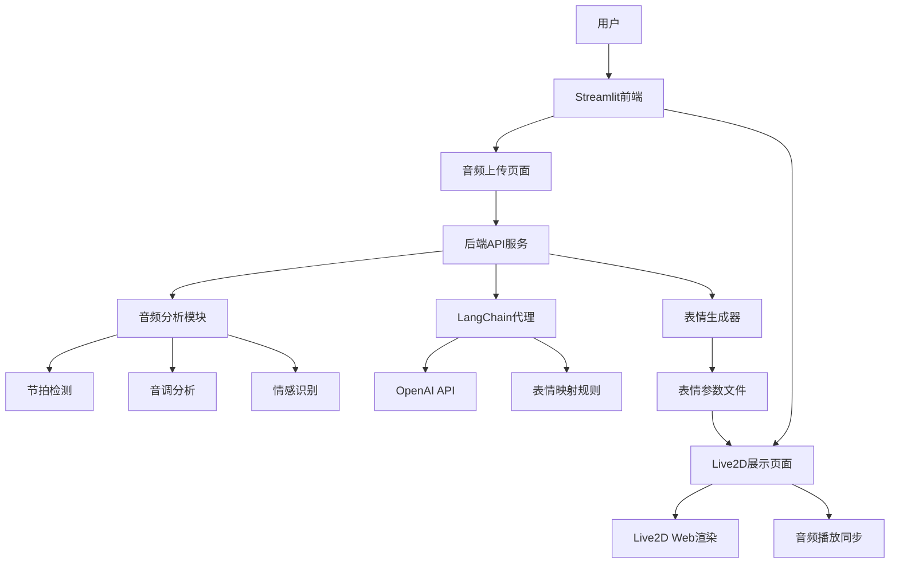

# 技术架构文档

## 🏗️ 整体架构



## 📊 数据流架构

### 1. 音频处理流程

```python
# 音频文件输入
音频文件 (.mp3/.wav/.m4a)
    ↓
# 预处理
音频格式转换 (统一为WAV)
    ↓
# 特征提取
节拍检测 (BPM、节拍时间点)
音调分析 (音高变化、调性)
频谱分析 (频率分布、能量)
    ↓
# 情感分析
音乐情感识别 (欢快、悲伤、激昂等)
    ↓
# 时间轴构建
构建时间-特征映射表
```

### 2. 表情生成流程

```python
# 音乐特征输入
音乐特征数据 (JSON格式)
    ↓
# LangChain处理
特征 → 自然语言描述
    ↓
# AI表情映射
自然语言 → 表情参数建议
    ↓
# 参数化处理
表情建议 → Live2D参数值
    ↓
# 时间轴同步
参数值 + 时间戳 → 表情动画文件
```

### 3. 前端渲染流程

```javascript
// Live2D模型加载
模型文件加载 (.model3.json)
    ↓
# 表情文件加载
表情参数文件 (.json)
    ↓
# 音频同步
音频播放控制 + 表情时间轴
    ↓
# 实时渲染
Live2D参数实时更新
```

## 🔧 核心组件设计

### 1. 音频分析模块 (AudioAnalyzer)

```python
class AudioAnalyzer:
    """音频分析核心类"""

    def __init__(self):
        self.sample_rate = 44100
        self.hop_length = 512

    def extract_features(self, audio_path: str) -> Dict:
        """提取音频特征"""
        features = {
            'tempo': self._extract_tempo(audio_path),
            'beats': self._extract_beats(audio_path),
            'pitch': self._extract_pitch(audio_path),
            'energy': self._extract_energy(audio_path),
            'emotion': self._analyze_emotion(audio_path)
        }
        return features

    def _extract_tempo(self, audio_path: str) -> float:
        """提取节拍"""
        y, sr = librosa.load(audio_path)
        tempo, _ = librosa.beat.beat_track(y=y, sr=sr)
        return float(tempo)

    def _extract_beats(self, audio_path: str) -> List[float]:
        """提取节拍时间点"""
        y, sr = librosa.load(audio_path)
        _, beats = librosa.beat.beat_track(y=y, sr=sr)
        return librosa.times_like(beats, sr=sr, hop_length=512).tolist()
```

### 2. LangChain 表情代理 (ExpressionAgent)

```python
class ExpressionAgent:
    """基于LangChain的表情生成代理"""

    def __init__(self, model_name: str = "gpt-3.5-turbo"):
        self.llm = ChatOpenAI(model_name=model_name)
        self.chain = self._build_chain()

    def _build_chain(self) -> LLMChain:
        """构建LangChain处理链"""
        template = """
        根据以下音乐特征，生成相应的Live2D表情参数：

        音乐特征：
        - 节拍：{tempo} BPM
        - 情感：{emotion}
        - 能量级别：{energy_level}
        - 时间点：{timestamp}

        请生成对应的表情参数（0-1之间的浮点数）：
        - 眼部开合度 (eye_open)
        - 眉毛高度 (eyebrow_height)
        - 嘴部开合度 (mouth_open)
        - 脸颊红晕 (cheek_blush)
        - 整体兴奋度 (excitement)

        输出格式：JSON
        """

        prompt = PromptTemplate(
            input_variables=["tempo", "emotion", "energy_level", "timestamp"],
            template=template
        )

        return LLMChain(llm=self.llm, prompt=prompt)
```

### 3. 表情生成器 (ExpressionGenerator)

```python
class ExpressionGenerator:
    """表情文件生成器"""

    def __init__(self, analyzer: AudioAnalyzer, agent: ExpressionAgent):
        self.analyzer = analyzer
        self.agent = agent

    def generate_expression_file(self, audio_path: str, output_path: str) -> str:
        """生成完整的表情文件"""

        # 1. 分析音频特征
        features = self.analyzer.extract_features(audio_path)

        # 2. 构建时间轴
        timeline = self._build_timeline(features)

        # 3. 生成表情参数
        expression_data = self._generate_expressions(timeline)

        # 4. 保存为JSON文件
        self._save_expression_file(expression_data, output_path)

        return output_path

    def _build_timeline(self, features: Dict) -> List[Dict]:
        """构建时间轴数据"""
        timeline = []
        beats = features['beats']

        for i, beat_time in enumerate(beats):
            timeline_point = {
                'timestamp': beat_time,
                'tempo': features['tempo'],
                'emotion': features['emotion'],
                'energy_level': self._calculate_energy_at_time(features, beat_time)
            }
            timeline.append(timeline_point)

        return timeline
```

## 🎨 Live2D 集成方案

### 1. 表情文件格式

```json
{
  "metadata": {
    "version": "1.0",
    "model_name": "示例模型",
    "duration": 180.5,
    "fps": 30
  },
  "expressions": [
    {
      "timestamp": 0.0,
      "parameters": {
        "ParamEyeLOpen": 1.0,
        "ParamEyeROpen": 1.0,
        "ParamEyeBrowLY": 0.0,
        "ParamEyeBrowRY": 0.0,
        "ParamMouthOpenY": 0.2,
        "ParamCheek": 0.0,
        "ParamBodyAngleX": 0.0
      },
      "transition_duration": 0.5
    },
    {
      "timestamp": 1.2,
      "parameters": {
        "ParamEyeLOpen": 0.3,
        "ParamEyeROpen": 0.3,
        "ParamMouthOpenY": 0.8,
        "ParamCheek": 0.3
      },
      "transition_duration": 0.3
    }
  ]
}
```

### 2. 前端 Live2D 控制器

```javascript
class Live2DController {
  constructor(canvas, modelPath) {
    this.canvas = canvas;
    this.app = new PIXI.Application({
      view: canvas,
      autoStart: true,
      resizeTo: canvas,
    });
    this.model = null;
    this.expressionData = null;
    this.currentTime = 0;

    this.loadModel(modelPath);
  }

  async loadModel(modelPath) {
    // 加载Live2D模型
    this.model = await Live2DModel.from(modelPath);
    this.app.stage.addChild(this.model);

    // 设置模型位置和缩放
    this.model.anchor.set(0.5, 0.5);
    this.model.position.set(this.canvas.width / 2, this.canvas.height / 2);
  }

  loadExpressionData(expressionData) {
    this.expressionData = expressionData;
  }

  updateExpression(currentTime) {
    if (!this.model || !this.expressionData) return;

    // 找到当前时间对应的表情参数
    const expression = this.findExpressionAtTime(currentTime);

    if (expression) {
      // 更新模型参数
      Object.entries(expression.parameters).forEach(([param, value]) => {
        this.model.internalModel.coreModel.setParameterValueById(param, value);
      });
    }
  }

  findExpressionAtTime(time) {
    // 查找时间轴上对应的表情
    const expressions = this.expressionData.expressions;

    for (let i = 0; i < expressions.length - 1; i++) {
      if (
        time >= expressions[i].timestamp &&
        time < expressions[i + 1].timestamp
      ) {
        // 可以在这里添加插值逻辑
        return expressions[i];
      }
    }

    return expressions[expressions.length - 1];
  }
}
```

## 🔌 API 接口设计

### RESTful API 端点

```python
# FastAPI路由定义
@app.post("/api/upload-audio")
async def upload_audio(file: UploadFile):
    """上传音频文件"""

@app.post("/api/analyze-audio/{file_id}")
async def analyze_audio(file_id: str):
    """分析音频特征"""

@app.post("/api/generate-expression/{file_id}")
async def generate_expression(file_id: str, config: ExpressionConfig):
    """生成表情文件"""

@app.get("/api/expression/{expression_id}")
async def get_expression(expression_id: str):
    """获取表情文件"""

@app.get("/api/models")
async def list_models():
    """获取可用的Live2D模型列表"""
```

## 📱 前端页面架构

### Streamlit 多页面应用

```python
# app.py - 主应用入口
import streamlit as st
from frontend.pages import upload, preview

st.set_page_config(
    page_title="歌颜随动",
    page_icon="🎵",
    layout="wide"
)

# 侧边栏导航
page = st.sidebar.selectbox(
    "选择页面",
    ["音乐上传", "Live2D预览"]
)

if page == "音乐上传":
    upload.show()
elif page == "Live2D预览":
    preview.show()
```

### 页面组件设计

```python
# frontend/pages/upload.py
def show():
    st.title("🎵 音乐上传与分析")

    # 文件上传
    uploaded_file = st.file_uploader(
        "选择音乐文件",
        type=['mp3', 'wav', 'm4a']
    )

    if uploaded_file:
        # 显示音频播放器
        st.audio(uploaded_file)

        # 分析配置
        col1, col2 = st.columns(2)

        with col1:
            model_choice = st.selectbox("选择Live2D模型", get_available_models())

        with col2:
            sensitivity = st.slider("表情敏感度", 0.1, 2.0, 1.0)

        # 开始分析
        if st.button("开始分析生成"):
            with st.spinner("正在分析音乐特征..."):
                result = process_audio(uploaded_file, model_choice, sensitivity)
                st.success(f"表情文件已生成：{result['expression_file']}")
```

## 🔍 性能优化策略

### 1. 音频处理优化

- 使用多线程处理音频特征提取
- 实现音频分段处理，避免内存溢出
- 缓存常用的音频分析结果

### 2. AI 推理优化

- 批量处理表情生成请求
- 实现本地模型缓存机制
- 优化 Prompt 模板减少 Token 消耗

### 3. 前端渲染优化

- Live2D 模型预加载和缓存
- 表情参数插值平滑过渡
- 音频播放与动画同步优化

## 🧪 测试策略

### 1. 单元测试

- 音频特征提取准确性测试
- 表情映射逻辑测试
- Live2D 参数有效性验证

### 2. 集成测试

- 完整流程端到端测试
- 不同格式音频文件兼容性测试
- 多模型支持测试

### 3. 性能测试

- 音频处理速度测试
- 内存使用监控
- 并发请求处理能力测试

---

这个技术架构为项目提供了清晰的开发路径和实现方案，确保各个模块之间的良好协作和系统的可扩展性。
